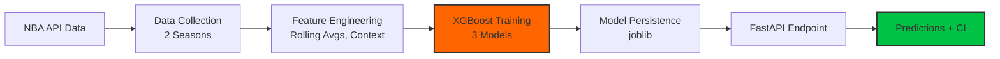

<div align="center">

# 🏀 NBA Performance Predictor

### ML-powered predictions for fantasy basketball dominance

[](https://nba-predictons.vercel.app)
[](https://github.com/jk2962/nba-predictor)


---

**Predict NBA player performance with machine learning.** Get next-game forecasts for points, rebounds, and assists with confidence intervals to make smarter fantasy basketball decisions.

[Features](#-features) • [Live Demo](#-live-deployment) • [Architecture](#-architecture) • [Getting Started](#-getting-started) • [API](#-api-reference)

</div>

---

## ✨ Features

<table>
<tr>
<td width="50%">

### 🔮 **ML Predictions**
XGBoost models trained on historical data predict:
- Points, rebounds, assists
- 95% confidence intervals
- Fantasy point projections

</td>
<td width="50%">

### 📊 **Interactive Analytics**
- Real-time performance charts
- Rolling average trends
- Season statistics
- Game-by-game breakdowns

</td>
</tr>
<tr>
<td width="50%">

### 🔍 **Smart Search**
- Fast autocomplete across 450+ players
- Filter by position, team, stats
- Advanced filtering options

</td>
<td width="50%">

### ⚖️ **Player Comparison**
- Compare 2-3 players side-by-side
- Head-to-head stat matchups
- Prediction comparison

</td>
</tr>
<tr>
<td width="50%">

### 📋 **Draft Helper**
- Fantasy rankings by VOR
- Position-based scarcity analysis
- Live draft recommendations

</td>
<td width="50%">

### 📈 **Model Transparency**
- MAE, RMSE, R² metrics displayed
- Model performance tracking
- Confidence score indicators

</td>
</tr>
</table>

---

## 🌐 Live Deployment

| Service | URL | Status |
|---------|-----|--------|
| **Frontend** | [nba-predictons.vercel.app](https://nba-predictons.vercel.app) |  |
| **Backend API** | [nba-predictor-t1f2.onrender.com](https://nba-predictor-t1f2.onrender.com) |  |
| **API Docs** | [/docs](https://nba-predictor-t1f2.onrender.com/docs) |  |

> **Note:** Backend uses Render's free tier - first request after 15min inactivity may take 30-60s (cold start)

---

## 🏗️ Architecture

### **System Overview**

```mermaid
graph TB
    subgraph "Client Layer"
        U[User Browser]
    end

    subgraph "Frontend - Vercel"
        FE[React SPA<br/>TypeScript + Vite]
        UI[Tailwind CSS<br/>Recharts]
    end

    subgraph "Backend - Render"
        API[FastAPI<br/>Python 3.11]
        ML[XGBoost Models<br/>Predictor Service]
        ORM[SQLAlchemy ORM]
    end

    subgraph "Data Layer"
        DB[(SQLite<br/>11MB)]
        NBA[nba_api<br/>Live Data]
    end

    U -->|HTTPS| FE
    FE -->|REST API| API
    API --> ML
    API --> ORM
    ORM --> DB
    NBA -.->|Data Seeding| DB

    style FE fill:#61dafb,stroke:#333,stroke-width:2px
    style API fill:#009688,stroke:#333,stroke-width:2px
    style ML fill:#ff6600,stroke:#333,stroke-width:2px
    style DB fill:#003b57,stroke:#333,stroke-width:2px
```



### **Tech Stack**

<table>
<tr>
<td valign="top" width="50%">

#### **Frontend**
- **Framework:** React 19 + TypeScript
- **Build Tool:** Vite 7
- **Styling:** Tailwind CSS 4
- **Charts:** Recharts 3
- **Routing:** React Router 7
- **HTTP Client:** Axios
- **Deployment:** Vercel

</td>
<td valign="top" width="50%">

#### **Backend**
- **Framework:** FastAPI 0.109
- **ORM:** SQLAlchemy 2.0
- **ML:** XGBoost 2.0, scikit-learn 1.4
- **Data:** Pandas 2.1, NumPy 1.26
- **API Data:** nba_api 1.4
- **Database:** SQLite
- **Deployment:** Render

</td>
</tr>
</table>

### **ML Pipeline**



**Features:**
- Rolling averages (5, 10, 15 game windows)
- Home/away indicators
- Rest days between games
- Shooting percentages (FG%, 3P%, FT%)
- Opponent strength metrics

**Models:**
- `points_model.joblib` - MAE ~4.2
- `rebounds_model.joblib` - MAE ~2.8
- `assists_model.joblib` - MAE ~1.9

---

## 🚀 Getting Started

### **Prerequisites**

```bash
Python 3.11+
Node.js 18+
```

### **Option 1: Docker Compose** *(Recommended)*

```bash
# Clone repository
git clone https://github.com/jk2962/nba-predictor.git
cd nba-predictor

# Start services
docker-compose up --build

# Seed database (in new terminal)
docker exec -it nba-predictor-backend-1 python -m scripts.seed_data
```

**Access:**
- Frontend: http://localhost:3000
- Backend: http://localhost:8000
- API Docs: http://localhost:8000/docs

---

### **Option 2: Manual Setup**

<details>
<summary><b>Backend Setup</b></summary>

```bash
cd backend

# Create virtual environment
python -m venv venv
source venv/bin/activate  # Windows: venv\Scripts\activate

# Install dependencies
pip install -r requirements.txt

# Initialize database & train models
python -m scripts.seed_data

# Start server
uvicorn app.main:app --reload --port 8000
```

**Backend runs at:** http://localhost:8000

</details>

<details>
<summary><b>Frontend Setup</b></summary>

```bash
cd frontend

# Install dependencies
npm install

# Start dev server
npm run dev
```

**Frontend runs at:** http://localhost:3000

</details>

---

## 📡 API Reference

### **Base URL**
```
https://nba-predictor-t1f2.onrender.com
```

### **Key Endpoints**

| Endpoint | Method | Description | Example |
|----------|--------|-------------|---------|
| `/api/players` | GET | List all players with filters | `?position=Guard&ppg_min=20` |
| `/api/players/search` | GET | Autocomplete search | `?q=lebron&limit=5` |
| `/api/players/top-performers` | GET | Top predicted players | `?stat=fantasy&limit=10` |
| `/api/players/{id}` | GET | Player details + season stats | `/api/players/2544` |
| `/api/players/{id}/predictions` | GET | Next game prediction | `/api/players/2544/predictions` |
| `/api/players/{id}/games` | GET | Recent game history | `?limit=10` |
| `/api/players/predictions/batch` | POST | Batch predictions | `{"player_ids": [1,2,3]}` |
| `/api/compare` | POST | Compare players | `{"players": ["LeBron", "Durant"]}` |
| `/api/draft/rankings` | GET | Fantasy draft rankings | `?league_size=12` |
| `/api/metrics` | GET | Model performance metrics | Returns MAE, RMSE, R² |

**Interactive Documentation:** [https://nba-predictor-t1f2.onrender.com/docs](https://nba-predictor-t1f2.onrender.com/docs)

---

## 📁 Project Structure

```
nba-predictor/
├── .env.example                # Environment variable template
├── .env.vercel.example         # Vercel-specific env template
├── .gitignore                  # Git ignore patterns
├── .vercelignore               # Vercel deployment ignore patterns
├── README.md                   # This file
├── VERCEL_DEPLOYMENT.md        # Deployment guide
├── docker-compose.yml          # Docker setup for local development
├── render.yaml                 # Render deployment configuration
├── vercel.json                 # Vercel deployment configuration
│
├── backend/                    # Python FastAPI Backend
│   ├── .python-version         # Python version specification
│   ├── runtime.txt            # Render Python runtime
│   ├── requirements.txt       # Python dependencies
│   ├── Dockerfile             # Docker configuration
│   ├── app/
│   │   ├── main.py            # FastAPI application entry
│   │   ├── config.py          # Configuration & settings
│   │   ├── database.py        # SQLAlchemy database setup
│   │   ├── models/            # SQLAlchemy ORM models
│   │   │   └── player.py
│   │   ├── schemas/           # Pydantic request/response schemas
│   │   │   ├── player.py
│   │   │   └── prediction.py
│   │   ├── routers/           # FastAPI route handlers
│   │   │   ├── players.py     # Player endpoints
│   │   │   ├── compare.py     # Player comparison
│   │   │   ├── draft.py       # Fantasy draft helper
│   │   │   └── metrics.py     # Model metrics
│   │   ├── services/          # Business logic layer
│   │   │   └── player_service.py
│   │   └── ml/                # Machine learning module
│   │       ├── predictor.py   # XGBoost prediction engine
│   │       └── feature_engineering.py
│   ├── scripts/
│   │   └── seed_data.py       # Data collection & model training
│   ├── data/
│   │   ├── nba.db            # SQLite database (11MB, gitignored)
│   │   └── *.csv             # Player data (gitignored)
│   └── models/                # Trained ML models (gitignored)
│       ├── points_model.joblib
│       ├── rebounds_model.joblib
│       ├── assists_model.joblib
│       └── metrics.joblib
│
└── frontend/                   # React + TypeScript Frontend
    ├── package.json           # Node dependencies
    ├── package-lock.json      # Dependency lock file
    ├── vite.config.ts        # Vite build configuration
    ├── tsconfig.json         # TypeScript configuration
    ├── index.html            # HTML entry point
    ├── Dockerfile            # Docker configuration
    └── src/
        ├── main.tsx          # React entry point
        ├── App.tsx           # Main app component with routing
        ├── index.css         # Global styles
        ├── components/        # Reusable React components
        │   ├── Navbar.tsx
        │   ├── PlayerCard.tsx
        │   ├── PredictionCard.tsx
        │   ├── StatsChart.tsx
        │   ├── SearchBar.tsx
        │   ├── PlayerBrowser.tsx
        │   ├── LoadingState.tsx
        │   └── ThemeToggle.tsx
        ├── pages/             # Route pages
        │   ├── HomePage.tsx
        │   ├── BrowsePage.tsx
        │   ├── PlayerDetailPage.tsx
        │   ├── ComparisonPage.tsx
        │   └── DraftHelperPage.tsx
        ├── services/
        │   └── api.ts        # Axios API client
        └── types/
            └── index.ts      # TypeScript type definitions
```

> **Note:** This is a production-ready structure. Development artifacts, test files, and build caches are excluded via `.gitignore`.

---

## 🔬 ML Model Details

### **Training Data**
- **Scope:** 2 NBA seasons (2022-2024)
- **Games:** ~2,500 player-game records
- **Features:** 20+ engineered features per game

### **Feature Engineering**

```python
Rolling Statistics:
├── Points:     [5, 10, 15] game rolling average
├── Rebounds:   [5, 10, 15] game rolling average
├── Assists:    [5, 10, 15] game rolling average
└── Minutes:    [5, 10, 15] game rolling average

Context Features:
├── Home/Away: Binary indicator
├── Rest Days:  Days since last game (0-7+)
└── Opponent:   Team strength metric

Shooting Efficiency:
├── FG%:  Field goal percentage (rolling)
├── 3P%:  Three-point percentage (rolling)
└── FT%:  Free throw percentage (rolling)
```

### **Model Performance**

| Stat | MAE | RMSE | R² | Interpretation |
|------|-----|------|----|----------------|
| **Points** | 4.2 | 5.8 | 0.78 | ±4.2 points average error |
| **Rebounds** | 2.8 | 3.9 | 0.71 | ±2.8 rebounds average error |
| **Assists** | 1.9 | 2.6 | 0.68 | ±1.9 assists average error |

> **Target:** MAE < 5 for points prediction ✅

### **Confidence Intervals**
Predictions include 95% confidence intervals using quantile regression:
```
Prediction: 25.3 points
Lower 95%: 18.1 points
Upper 95%: 32.5 points
```

---

## 🛠️ Development

### **Run Tests**
```bash
# Backend unit tests
cd backend
pytest

# Frontend type checking
cd frontend
npm run type-check
```

### **Build for Production**
```bash
# Frontend production build
cd frontend
npm run build

# Backend with Gunicorn
cd backend
gunicorn app.main:app -w 4 -k uvicorn.workers.UvicornWorker
```

### **Code Quality**
```bash
# Python linting
ruff check backend/

# TypeScript linting
cd frontend && npm run lint
```

---

## 🚢 Deployment

### **Vercel (Frontend)**
```bash
vercel --prod
```

**Environment Variables:**
```env
VITE_API_URL=https://nba-predictor-t1f2.onrender.com
```

### **Render (Backend)**
1. Connect GitHub repository
2. Select `backend` as root directory
3. Set Python version: `3.11.9`
4. Deploy

**Environment Variables:**
```env
DATABASE_URL=sqlite:///./data/nba.db
PYTHON_VERSION=3.11.9
```

See [VERCEL_DEPLOYMENT.md](VERCEL_DEPLOYMENT.md) for detailed deployment guide.

---

## 🤝 Contributing

Contributions are welcome! Please feel free to submit a Pull Request.

1. Fork the repository
2. Create your feature branch (`git checkout -b feature/AmazingFeature`)
3. Commit your changes (`git commit -m 'Add some AmazingFeature'`)
4. Push to the branch (`git push origin feature/AmazingFeature`)
5. Open a Pull Request

---

## 📝 License

This project is licensed under the MIT License - see the [LICENSE](LICENSE) file for details.

---

## 🙏 Acknowledgments

- **NBA Data:** [nba_api](https://github.com/swar/nba_api) for providing NBA statistics
- **ML Framework:** [XGBoost](https://xgboost.readthedocs.io/) for gradient boosting models
- **UI Inspiration:** Modern sports analytics dashboards

---

<div align="center">

### ⭐ Star this repo if you find it helpful!

[](https://github.com/jk2962/nba-predictor)
[](https://github.com/jk2962/nba-predictor/fork)

**Made with ❤️ for fantasy basketball fans**

[🌐 Live Demo](https://nba-predictons.vercel.app) • [📚 API Docs](https://nba-predictor-t1f2.onrender.com/docs) • [🐛 Report Bug](https://github.com/jk2962/nba-predictor/issues)

</div>
