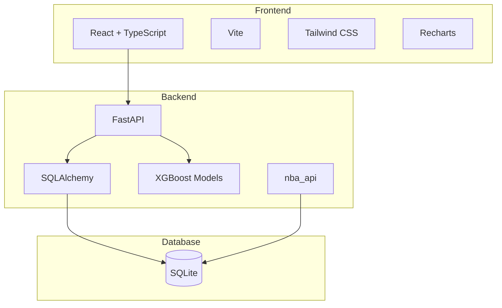

# NBA Player Performance Prediction MVP

An AI-powered web application that predicts NBA player performance using machine learning, helping with fantasy basketball draft decisions.


## Features

- 🔮 **AI Predictions**: XGBoost models predict points, rebounds, and assists with confidence intervals
- 🔍 **Player Search**: Fast autocomplete search across all NBA players
- 📊 **Performance Charts**: Interactive Recharts visualizations of recent performance
- ⚖️ **Player Comparison**: Compare 2-3 players side by side
- 📋 **Draft Helper**: Sortable ranked list by projected fantasy value
- 📈 **Model Metrics**: MAE, RMSE, R² displayed for transparency

## Architecture



## Quick Start

### Prerequisites

- Python 3.10+
- Node.js 18+
- Docker & Docker Compose (optional)

### Option 1: Docker Compose (Recommended)

```bash
# Clone and start
docker-compose up --build

# First time: seed the database (in a new terminal)
docker exec -it untitled-project-backend-1 python -m scripts.seed_data
```

### Option 2: Manual Setup

**Backend:**
```bash
cd backend

# Create virtual environment
python -m venv venv
source venv/bin/activate  # Windows: venv\Scripts\activate

# Install dependencies
pip install -r requirements.txt

# Initialize database and seed data
python -m scripts.seed_data

# Start server
uvicorn app.main:app --reload --port 8000
```

**Frontend:**
```bash
cd frontend

# Install dependencies
npm install

# Start dev server
npm run dev
```

### Access the Application

- **Frontend**: http://localhost:3000
- **Backend API**: http://localhost:8000
- **API Docs**: http://localhost:8000/docs

## API Endpoints

| Endpoint | Method | Description |
|----------|--------|-------------|
| `/api/players` | GET | List players with pagination, search, filtering |
| `/api/players/search` | GET | Quick search for autocomplete |
| `/api/players/top-performers` | GET | Top 10 by predicted performance |
| `/api/players/{id}` | GET | Player details with season stats |
| `/api/players/{id}/games` | GET | Recent game stats |
| `/api/players/{id}/predictions` | GET | Next game prediction |
| `/api/players/predictions/batch` | POST | Batch predictions |
| `/api/metrics` | GET | Model evaluation metrics |

## Project Structure

```
├── backend/
│   ├── app/
│   │   ├── main.py          # FastAPI app
│   │   ├── config.py        # Settings
│   │   ├── database.py      # SQLAlchemy setup
│   │   ├── models/          # ORM models
│   │   ├── schemas/         # Pydantic schemas
│   │   ├── routers/         # API endpoints
│   │   ├── services/        # Business logic
│   │   └── ml/              # XGBoost predictor
│   ├── scripts/
│   │   └── seed_data.py     # Data seeding & model training
│   └── models/              # Saved ML models
├── frontend/
│   ├── src/
│   │   ├── components/      # React components
│   │   ├── pages/           # Route pages
│   │   ├── services/        # API client
│   │   └── types/           # TypeScript types
│   └── index.html
├── docker-compose.yml
└── README.md
```

## ML Model Details

### Feature Engineering
- **Rolling averages**: 5, 10, 15 game windows for PTS, REB, AST, MIN
- **Game context**: Home/away indicator, rest days
- **Season stats**: Expanding averages
- **Shooting**: FG%, 3P%, FT% rolling averages

### Training
Models are trained on 2 seasons of historical data using XGBoost regression:
- `points_model.joblib`
- `rebounds_model.joblib`
- `assists_model.joblib`

### Metrics
Target: MAE < 5 points for the points model

## Tech Stack

**Backend:**
- FastAPI (API framework)
- SQLAlchemy (ORM)
- Pandas, NumPy (Data processing)
- XGBoost, scikit-learn (ML)
- nba_api (Data source)

**Frontend:**
- React 18 + TypeScript
- Vite (Build tool)
- Tailwind CSS (Styling)
- Recharts (Visualization)
- React Router (Navigation)
- Axios (HTTP client)

## Development

```bash
# Backend tests
cd backend && pytest

# Frontend build
cd frontend && npm run build

# Type checking
cd frontend && npm run type-check
```

## License

MIT
